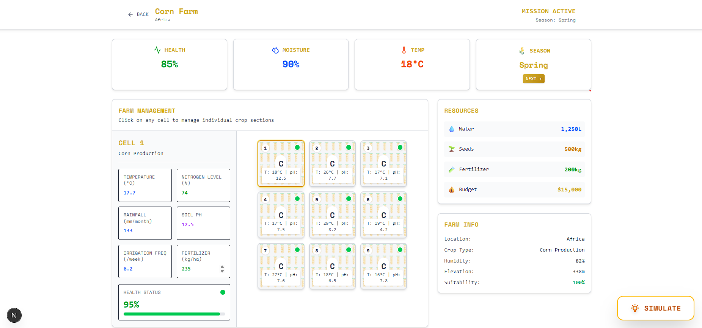
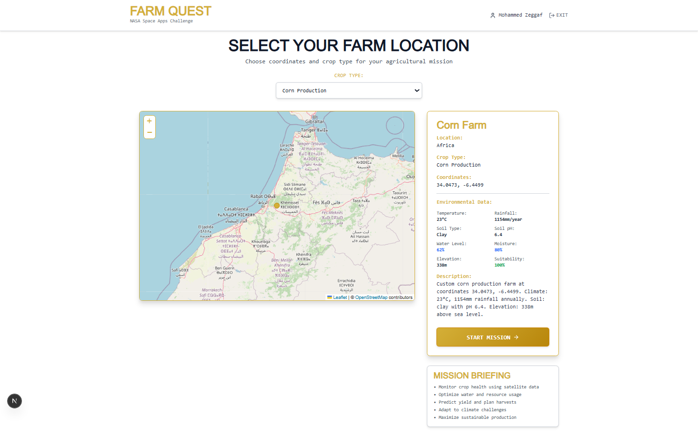
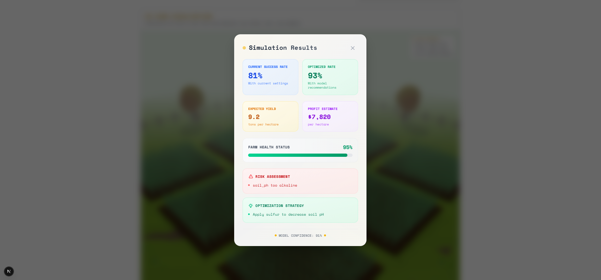
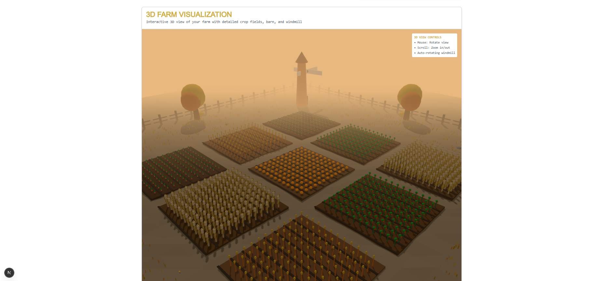
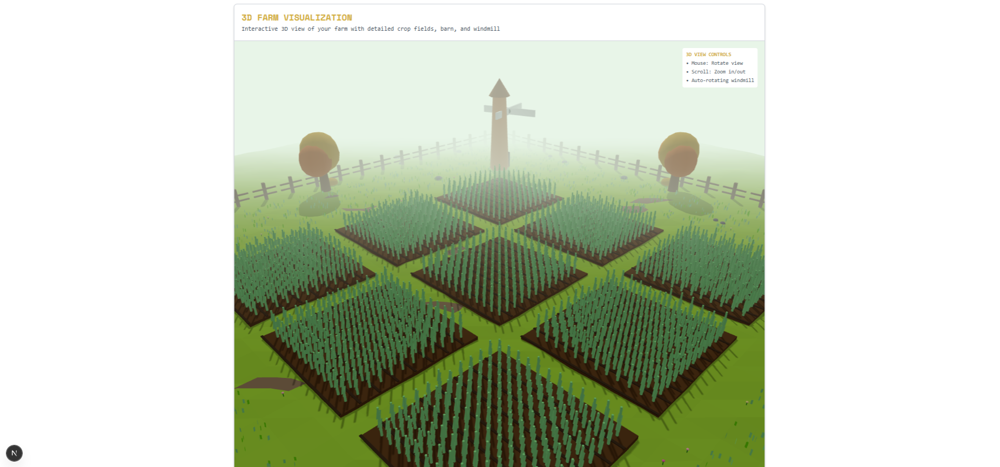

# Farm Quest - NASA Space Apps Challenge 2025

A minimalist web game for the NASA Space Apps Challenge where players manage virtual farms using real-world satellite data and agricultural insights.

## Features

- 🔐 **Google OAuth Login** - Seamless authentication with Google accounts
- 🗺️ **Interactive Globe Map** - Select farms directly from an interactive 3D globe showing real-world locations across different continents
- 🎮 **Farm Management Game** - Monitor crops, manage resources, and optimize yields
- 🛰️ **Space-themed UI** - Minimal dark design with space/satellite aesthetics

## Technologies Used

- **Next.js 15** with App Router
- **TypeScript** for type safety
- **Tailwind CSS** for styling
- **NextAuth.js** for Google OAuth
- **Google Fonts** (Space Mono, Orbitron) for that cool tech look
- **Lucide React** for icons

### Installation

1. **Clone and install dependencies:**
   ```bash
   npm install
   ```

2. **Set up environment variables:**
   
   Copy `.env.example` and fill in your credentials:
   ```env
   # NextAuth.js Configuration
   NEXTAUTH_URL=your_domain_url
   NEXTAUTH_SECRET=your_nextauth_secret_here
   
   # Google OAuth Configuration
   GOOGLE_CLIENT_ID=your_google_client_id_here
   GOOGLE_CLIENT_SECRET=your_google_client_secret_here
   ```

3. **Run the development server:**
   ```bash
   npm run dev
   ```

## Game Flow

1. **Login** - Authenticate with Google OAuth
2. **Globe Farm Selection** - Navigate an interactive 3D globe and click to select from real-world satelite map.
3. **Farm Management** - Monitor crops, manage resources, and complete missions

## Screenshots











## AI Usage Disclaimer

**IMPORTANT LEGAL NOTICE:** This project incorporates artificial intelligence (AI) technologies for educational and demonstration purposes in connection with the NASA Space Apps Challenge 2025. The AI-generated content, suggestions, recommendations, and any automated decision-making features within this application are provided "AS IS" without warranty of any kind, express or implied. 

**Users acknowledge and agree that:**
- AI-generated agricultural recommendations are for simulation purposes only and should not be relied upon for actual farming decisions
- No liability is assumed for any damages, losses, or adverse outcomes resulting from reliance on AI-generated content
- The accuracy, completeness, or reliability of AI outputs cannot be guaranteed
- Users are solely responsible for validating any information before practical application
- This disclaimer extends to all contributors, maintainers, and affiliated parties

By using this application, you acknowledge that you have read, understood, and agree to be bound by this disclaimer.

## License

MIT License - feel free to use this as a starting point for your own NASA Space Apps projects!

## Credits & Acknowledgments

**NASA Space Apps Challenge 2025**
- This project was developed as part of the [NASA Space Apps Challenge](https://www.spaceappschallenge.org/), a global hackathon focused on space exploration and Earth science
- Special thanks to NASA for providing open data, APIs, and inspiring innovation in space technology
- Challenge: NASA Farm Navigators: NASA Data Exploration in Agriculture challenge 2025
- Team: Spaceless

**Data Sources:**
- NASA POWER API
- Synthetic Data generated with algorithms

**Technologies & APIs:**
- NASA Open Data Portal
- OpenStreetMap

---

**Built with 💚 for NASA Space Apps Challenge 2025**  
*Connecting Earth and Space through Agricultural Innovation*


